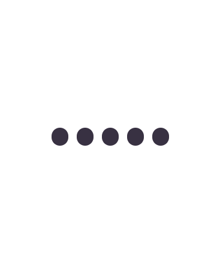
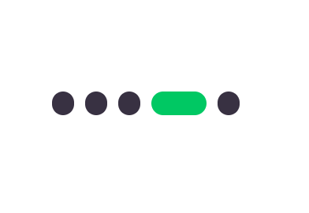

# Day 6 | Dot Pagination

> 항상 JS로 구현했었는데.... CSS로만 구현이 가능하다. </br>
> flex 속성과 :focus 속성이 포인트

 </br>

 </br>

```html
<!-- index.html -->
<body>
    <div class="pager">
        <button><span></span></button>
        <button><span></span></button>
        <button><span></span></button>
        <button><span></span></button>
        <button><span></span></button>
    </div>
</body>
```

```css
/* index.css */
*{
    box-sizing: border-box;
    margin: 0;
    padding: 0;
}

body{
    display: grid;
    place-items: center;
    height: 100vh;
}

.pager{
    width: 250px;
    display: flex;
    align-items: center;
    justify-content: center;
}

.pager button{
    flex: 0 0 42px;
    height: 42px;
    border: 0;
    padding: 7px;
    background-color: transparent;
    cursor: pointer;
    transition: 0.4s;
}

.pager button:focus{
    flex: 0 0 84px;
}

.pager button span{
    display: block;
    height: 30px;
    width: 100%;
    border-radius: 15px;
    background-color: #383142;
}

.pager button:focus span{
    background-color: #00c863;
}
```