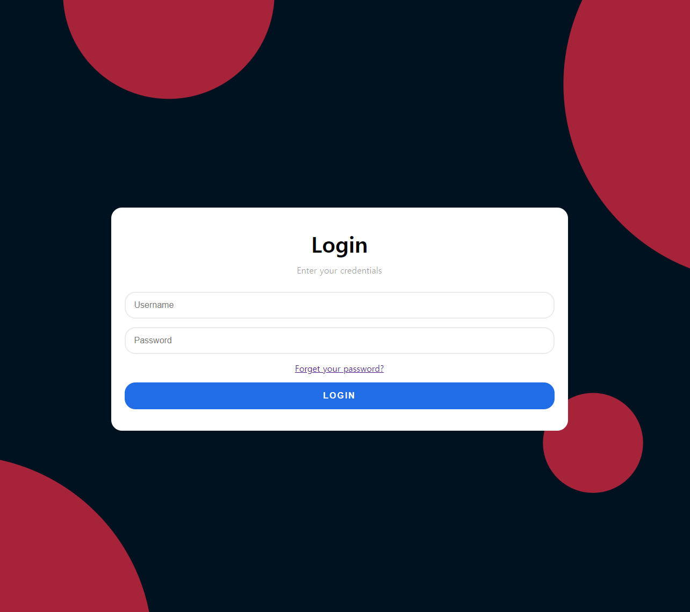
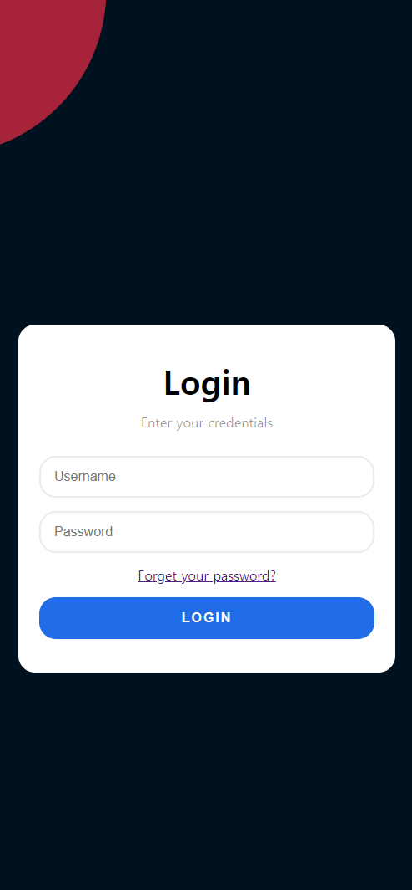

# Day 7 | Modern Login Page #1


 </br>

 </br>

 </br>

```html
<!-- index.html -->
    <div class="login-card">
        <h2>Login</h2>
        <h3>Enter your credentials</h3>

        <form action="" class="login-form">
            <input type="text" placeholder="Username">
            <input type="password" placeholder="Password">
            <a href="#">Forget your password?</a>
            <button type="submit">LOGIN</button>
        </form>
    </div>
```

```css
/* index.css */
*{
    margin: 0;
    padding: 0;
    box-sizing: border-box;
}

html, body{
    height: 100%;
}

body{
    display: grid;
    place-items: center;
    padding: 0 24px;
    background-image: url('./circle-scatter-haikei.svg');
    background-repeat: no-repeat;
    background-size: cover;
    background-position: center center;
    color: #000;
    animation: rotate 6s infinite alternate linear;
}

.login-card{
    position: relative;
    z-index: 9;
    width: 100%;
    max-width: 850px;
    text-align: center;    
    background-color: #fff;
    border-radius: 1.25rem;
    padding: 40px 25px;
}

.login-card h2 {
    font-size: 2.5rem;
    font-weight: bold;
    margin-bottom: 12px;
}

.login-card h3 {
    color: rgba(0, 0, 0, 0.4);
    margin-bottom: 30px;
    font-weight: 500;
    font-size: 1rem;
}

.login-form{
    width: 100%;
    display: grid;
    gap: 16px;
}

.login-form input,
.login-form button{
    width: 100%;
    height: 50px;
}

.login-form input{
    border: 2px solid #ebebeb;
    font-size: 1rem;
    padding: 0 16px;
    border-radius: 1.25rem;
    transition: all 0.5s;
    outline: none;
}

.login-form input:hover{
    border:2px solid #10449a;
}

.login-form button{
    cursor: pointer;
    width: 100%;
    padding: 0 16px;
    border-radius: 1.25rem;
    background-color: #216ce7;
    color: #f9f9f9;
    border: none;
    font-size: 1rem;
    font-weight: 600;
    text-align: center;
    letter-spacing: 2px;
    transition: all 0.4s;
}

.login-form button:hover{
    background-color: #10449a;
}
```