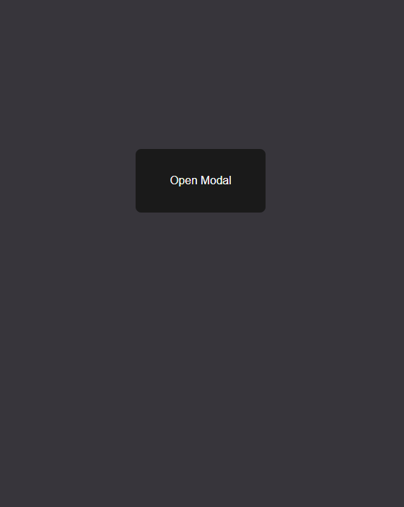

# Day 9 | Modal #1

- 모달 버튼

 </br></br>

- 오픈 시 애니메이션 #1

 </br></br>

- 오픈 시 애니메이션 #2

 </br></br>

- 모달 오픈

 </br>
---

```html
<!-- index.html -->
    <button onclick="toggleModal()" type="button">Open Modal</button>
    <div class="modal-background" onclick="toggleModal()"></div>
    <div class="modal">
        <h2>Modal Window</h2>
        <p>Modal Opened</p>
    </div>
```

```js
// index.js
const toggleModal = () => {
    document.body.classList.toggle("open");
};
```

```css
/* index.css */
*{
    margin: 0;
    padding: 0;
    box-sizing: border-box;
}

html, body{
    height: 100%;
}

body{
    margin: 0;
    display: grid;
    place-items: center;
    background: #37353b;
}

button{
    cursor: pointer;
    background: #1a1a1a;
    color: #f9f9f9;
    border: 0;
    border-radius: 8px;
    padding: 20px 36px;
    font-size: 16px;
}

.modal-background{
    position: fixed;
    top: 0;
    left: 0;
    width: 100%;
    height: 100%;
    display: grid;
    place-items: center;
    opacity: 0;
    visibility: hidden;
    transform: scale(1, 1);
    background: rgba(0, 0, 0, 0.5);
    transition: 0.5s;
}

body.open .modal-background{
    visibility: visible;
    opacity: 1;
    animation: background-in 1s both;
}

.modal{
    position: fixed;
    top: 50%;
    left: 50%;
    background: #37353b;
    color: #f9f9f9;
    padding: 48px 40px;
    border-radius: 12px;
    width: 300px;
    translate: -50% -50%;
    opacity: 0;
    visibility: hidden;
    transition: 0.3s;
}

body.open .modal{
    opacity: 1;
    visibility: visible;
    animation: modal-in 1s;
}

h2{
    margin: 0 0 8px;
    font-weight: 400;
    font-size: 21px;
}

p{
    margin: 0;
    color: rgba(255, 255, 255, 0.5);
}

@keyframes background-in{
    0%{
        scale: 0 0.005;
    }
    33%{
        scale: 1 0.005;
    }
    66%, 100%{
        scale: 1 1;
    }
}


@keyframes modal-in{
    0%, 66%{
        opacity: 0;
        visibility: hidden;
        translate: -50% -30%;
    }
    100%{
        opacity: 1;
        visibility: visible;
    }
}
```