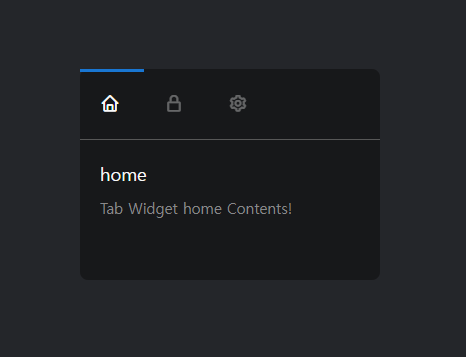
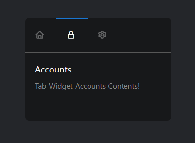
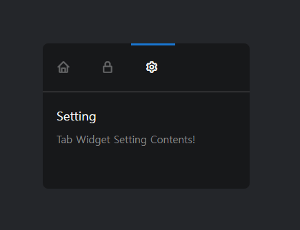

# Day 10 | Modern Widget

> 항사 JS로 구현했던 것... 단순히 HTML + CSS로 구현 가능!!

 </br></br>

 </br></br>

 </br></br>

```html
<!-- index.html -->
<div class="widget">
        <div class="tabs">
            <input type="radio" name="group" id="tab-1" checked>
            <input type="radio" name="group" id="tab-2">
            <input type="radio" name="group" id="tab-3">
            <div class="buttons">
                <label for="tab-1">
                    <i class='bx bx-home'></i>
                </label>
                <label for="tab-2">
                    <i class='bx bx-lock-alt'></i>
                </label>
                <label for="tab-3">
                    <i class='bx bx-cog'></i>
                </label>
                <div class="underline"></div>
            </div>
            <div class="content">
                <div class="content-inner">
                    <div>
                        <h2>home</h2>
                        <p>Tab Widget home Contents!</p>
                    </div>
                    <div>
                        <h2>Accounts</h2>
                        <p>Tab Widget Accounts Contents!</p>
                    </div>
                    <div>
                        <h2>Setting</h2>
                        <p>Tab Widget Setting Contents!</p>
                    </div>
                </div>
            </div>
        </div>
    </div>
```

```css
/* index.css */
*{
    margin: 0;
    padding: 0;
    box-sizing: border-box;
}

html, body{
    height: 100%;
}

:root{
    --color-primary : #1976d2;
    --tab-width : 300px;
    --button-width : 64px;
}

body{
    display: grid;
    place-items: center;
    line-height: 1.5;
    background-color: #24262a;
    color: #f9f9f9;
}

.widget{
    background-color: #17181a;
    width: var(--tab-width);
    border-radius: 8px;
}

input{
    display: none;
}

h2{
    margin: 0 0 10px;
    font-size: 18px;
    font-weight: 400;
}

.content{
    position: relative;
    overflow: hidden;
    height: 140px;
}

.content-inner{
    position: absolute;
    top: 0;
    left: 0;
    display: flex;
    align-items: center;
    width: calc(var(--tab-width) * 3);
    transition: 0.3s;
}

.content-inner div {
    width: inherit;
    padding: 20px;
}

label{
    padding: 20px;
    font-size: 20px;
    width: var(--button-width);
    opacity: 0.35;
    cursor: pointer;
}

p{
    font-size: 15px;
    color: #888889;
}

.buttons{
    position: relative;
    display: flex;
    border-bottom: 1px solid #575757;
}

.underline{
    position: absolute;
    top: 0;
    left: 0;
    width: var(--button-width);
    height: 3px;
    background-color: var(--color-primary);
    transition: 0.2s;
}

.tabs input:nth-child(1):checked ~ .buttons .underline{
    translate: 0 0;
}

.tabs input:nth-child(2):checked ~ .buttons .underline{
    translate: var(--button-width) 0;
}

.tabs input:nth-child(3):checked ~ .buttons .underline{
    translate: calc(var(--button-width) * 2) 0;
}

.tabs input:nth-child(1):checked ~ .buttons label:nth-child(1),
.tabs input:nth-child(2):checked ~ .buttons label:nth-child(2),
.tabs input:nth-child(3):checked ~ .buttons label:nth-child(3){
    opacity: 1;
}

.tabs input:nth-child(1):checked ~ .content > .content-inner {
    translate: 0 0;
}

.tabs input:nth-child(2):checked ~ .content > .content-inner {
    translate: calc(0px - var(--tab-width)) 0;
}

.tabs input:nth-child(3):checked ~ .content > .content-inner {
    translate: calc(0px - var(--tab-width) * 2) 0;
}
```