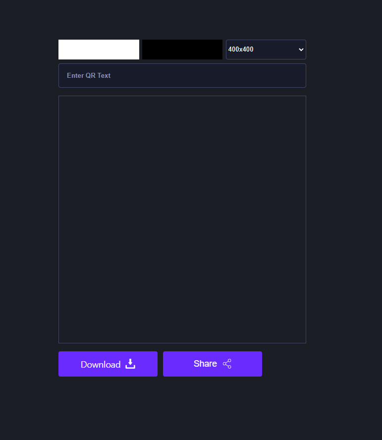
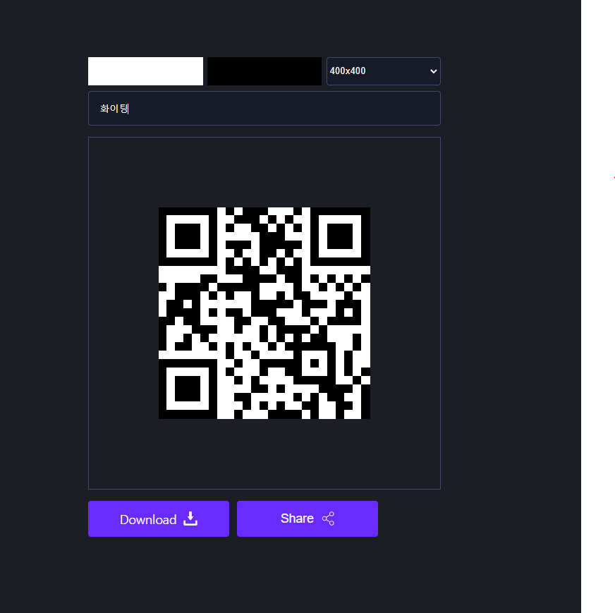

# Day 5 | Qr Code Generator

> 사용 Api : https://cdnjs.com/libraries/qrcodejs

 </br>

 </br>

```html
<!-- index.html -->
<!DOCTYPE html>
<html lang="en">

<head>
    <meta charset="UTF-8">
    <meta http-equiv="X-UA-Compatible" content="IE=edge">
    <meta name="viewport" content="width=device-width, initial-scale=1.0">
    <title>Day 5 | Qr Code Generator</title>
    <link rel="stylesheet" href="./index.css">
    <script src="./index.js" defer></script>
    <script src="https://cdnjs.cloudflare.com/ajax/libs/qrcodejs/1.0.0/qrcode.min.js" defer></script>
</head>

<body>
    <section>
        <div class="row">
            <input type="color" class="light" value="#ffffff">
            <input type="color" class="dark">
            <select class="sizes">
                <option value="100">100x100</option>
                <option value="100">200x200</option>
                <option value="100">300x300</option>
                <option value="100" selected>400x400</option>
                <option value="100">500x500</option>
                <option value="100">600x600</option>
                <option value="100">700x700</option>
                <option value="100">800x800</option>
                <option value="100">900x900</option>
                <option value="100">1000x1000</option>
            </select>
        </div>
        <input type="text" class="qr-text" placeholder="Enter QR Text">
        <div id="qr-code"></div>
        <div class="action-container">
            <a href="#" class="download btn" download='QRCode'>
                <span>Download</span>
                
            </a>
            <button class="btn share-btn">
                <span>Share</span>
                
            </button>
        </div>
    </section>
</body>

</html>
```

```js
// index.js
const download = document.querySelector(".download");
const qrContainer = document.querySelector("#qr-code");

const defaultUrl = "Front-end Developer";
let colorDark = "#000",
  colorLight = "#fff",
  text = defaultUrl,
  size = 300;

const dark = document.querySelector(".dark");
const handleDarkColor = (e) => {
    colorDark = e.target.value;
    generateQRCode();
}
dark.addEventListener("input", handleDarkColor);

const light = document.querySelector(".light");
const handleLightColor = (e) => {
    colorLight = e.target.value;
    generateQRCode();
}
light.addEventListener("input", handleLightColor);

const qrText = document.querySelector(".qr-text");
const handleQrText = (e) => {
    const value = e.target.value;
    text = value;
    if(!value){
        text = defaultUrl;
    }
    generateQRCode();
}
qrText.addEventListener("input", handleQrText);

const generateQRCode = async () => {
    qrContainer.innerHTML = "";
    new QRCode("qr-code", {
        text,
        height: size,
        width: size,
        colorDark,
        colorLight
    });
    download.href = await resolveDataUrl();
}

const shareBtn = document.querySelector(".share-btn");
const handleShare = async () => {
    console.log('s')
    setTimeout(async () => {
        try{
            const base64url = await resolveDataUrl();
            const blob = await(await fetch(base64url)).blob();
            const file = new File([blob], "QRCode.png", {
                type: blob.type,
            })
            await navigator.share({
                files: [file],
                title: text,
            });
        } catch (error){
            alert("Your browser doesn't support share.")
        }
    },100);    
}
shareBtn.addEventListener("click", handleShare);

const sizes = document.querySelector(".sizes");
const handlesizes = (e) => {
    size = e.target.value;
    generateQRCode();
}
sizes.addEventListener("change", handlesizes);

const resolveDataUrl = () => {
    return new Promise((resolve, reject) => {
        setTimeout(()=>{
            const img = document.querySelector("#qr-code img");
            if(img.currentSrc){
                resolve(img.currentSrc);
                return;
            }
            const canvas = document.querySelector("canvas");
            resolve(canvas.toDataURL());
        }, 50);
    })
}

generateQRCode();
```

```css
/* index.css */
*{
    box-sizing: border-box;
    margin: 0;
    padding: 0;
}

body{
    background-color: #1c1e26;
    max-width: 500px;
    height: 100vh;
    display: flex;
    align-items: center;
    justify-content: center;
    color: #fff;
    margin: 0 auto;
}

section{
    margin: 0 auto;
}

input[type='color']{
    border: none;
    width: 32.5%;
    height: 40px;
}

input[type='color']::-webkit-color-swatch-wrapper{
    padding: 0;
}

input[type='color']::-webkit-color-swatch{
    border: none;
}

a{
    text-decoration: none;
}

.qr-text{
    padding:1rem;
    display: block;
    background: #181b29;
    border: 1px solid #414866;
    border-radius: 4px;
    width: 100%;
    margin: 0.5rem 0 1rem 0;
    color: #fff;
    outline: none;
}

.qr-text.qr-text::placeholder{
    color: #8b92b7;
    font-weight: bold;
}

#qr-code{
    height: 500px;
    width: 500px;
    display: flex;
    align-items: center;
    justify-content: center;
    border: 1px solid #414866
}

#qr-code img, #qr-code canvas{
    max-width: 100% !important;
    max-height: 100% !important;
}

.row{
    display:flex;
    align-items: center;
    justify-content: space-between;
}

.sizes{
    width: 32.5%;
    height: 40px;
    color: #fff;
    background-color: #181b29;
    border: 1px solid #414866;
    border-radius: 4px;
    outline: none;
}

.btn{
    color: #fff;
    max-width: 200px;
    width: 100%;
    padding: 14px;
    background: rgb(106, 43, 255);
    border-radius: 4px;
    border: none;
    display: flex;
    align-items: center;
    justify-content: center;
    cursor: pointer;
    font-size: 1.1rem;
    font-weight: 500;
    flex:1;
}

.btn img{
    width: 20px;
    margin-left: 10px;
}
.share-btn{
    margin-left: 0.7rem;
}
.action-container{
    display: flex;
    margin: 1rem 0;
}

@media(max-width:512px){
    body{
        max-width: 100%;
        padding: 10px;
    }
    #qr-code{
        width: 95vw;
        height: 95vw;
    }
    #qr-code img, #qr-code canvas{
        max-width: 95vw !important;
        max-height: 95vw !important;
    }
}

@media(max-width:350px){
    .action-container{
        flex-direction: column;
        align-items: center;
    }        
    .share-btn{
        margin-left: 0;
        margin-top: 0.7rem;
    }        
}
```