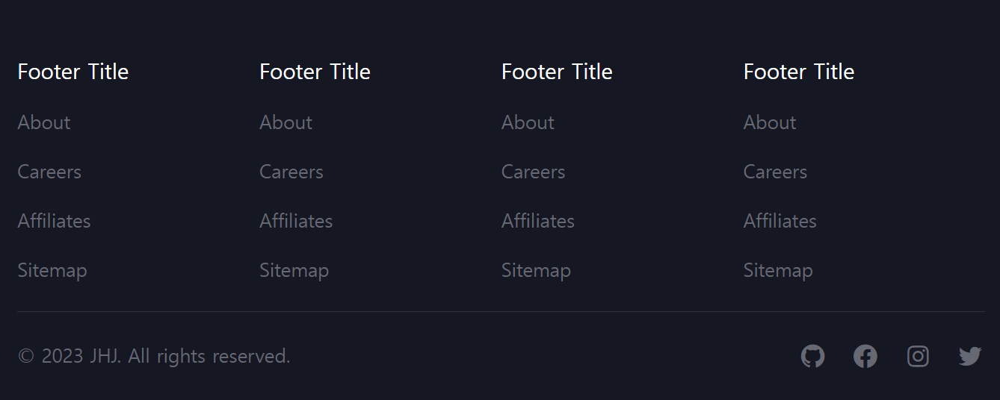
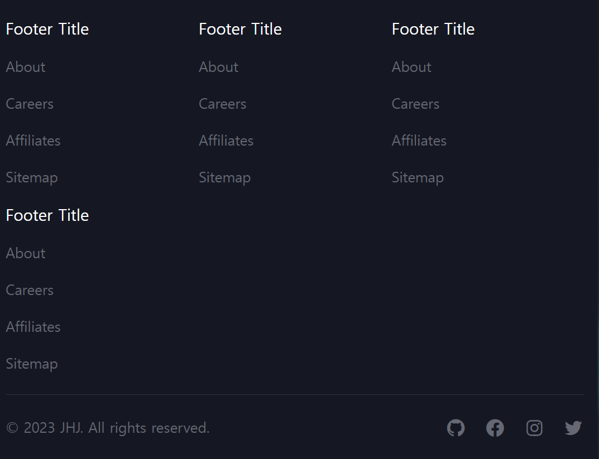
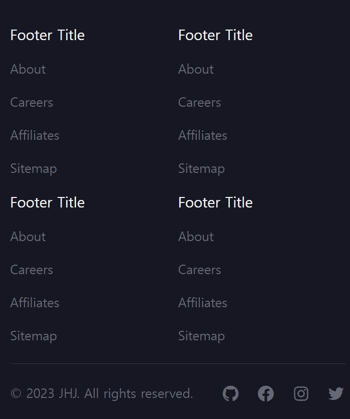
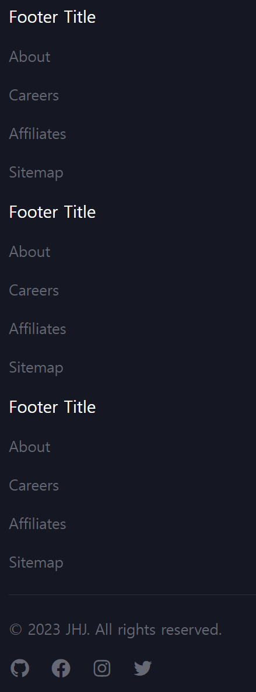
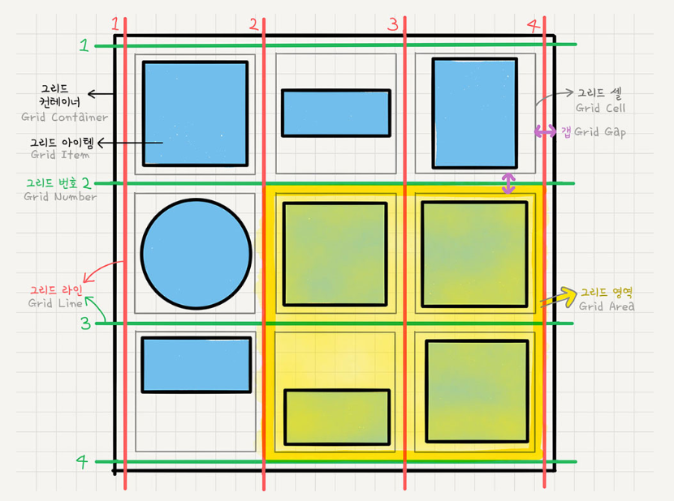
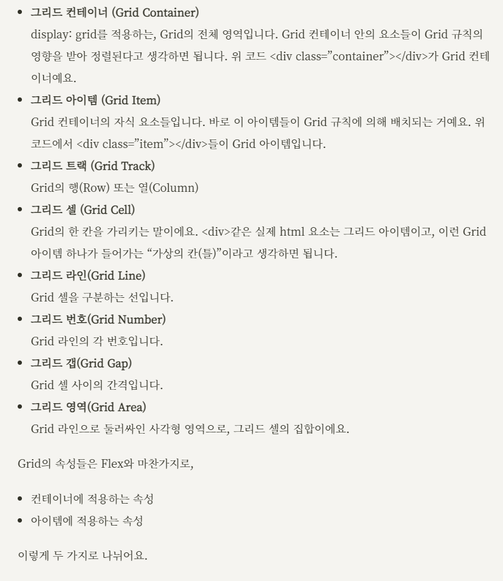
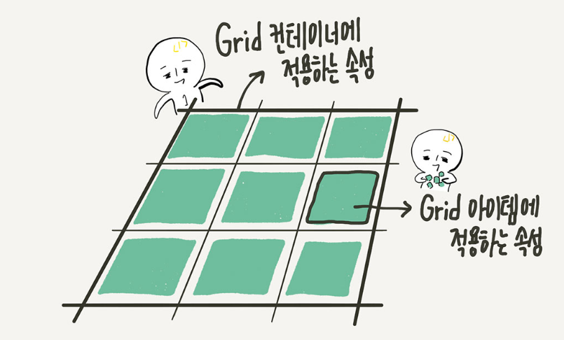
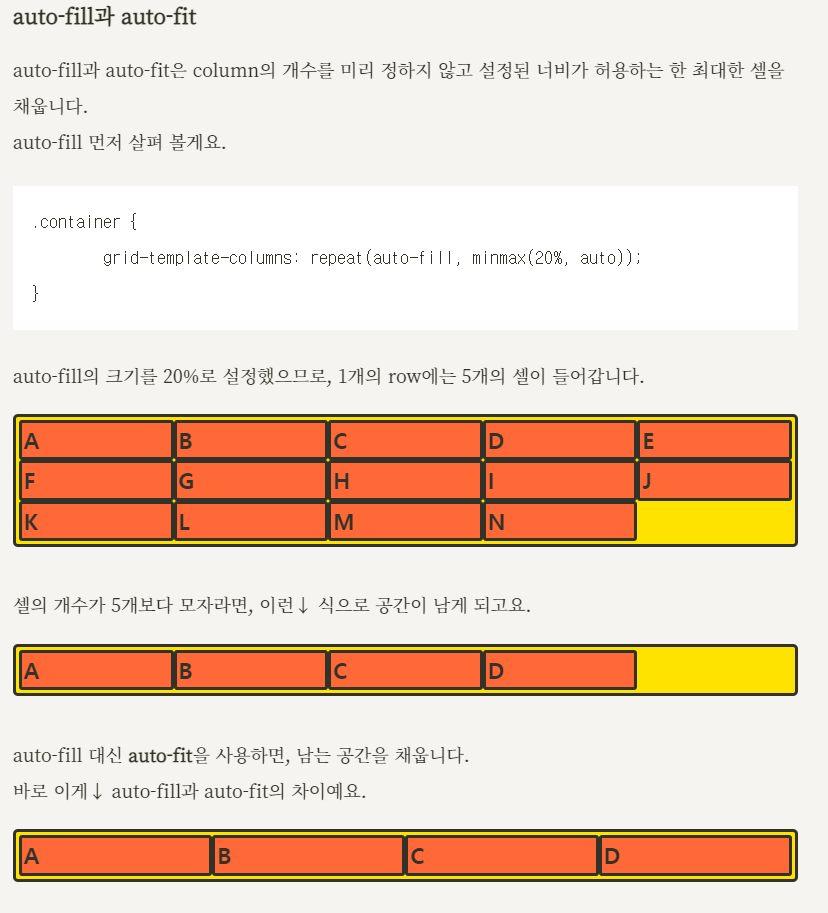

# Day 11 | Resizable Footer 

  
 </br></br>

  
 </br></br>

  
 </br></br>


 </br>

---

```html
<!-- index.html -->
<footer class="footer">
        <div class="footer-container">
            <div class="footer-top">
                <div>
                    <h6 class="footer-title">Footer Title</h6>
                    <ul class="footer-list">
                        <li class="footer-list-item">
                            <a href="#" class="footer-list-link"> About </a>
                        </li>
                        <li class="footer-list-item">
                            <a href="#" class="footer-list-link"> Careers </a>
                        </li>
                        <li class="footer-list-item">
                            <a href="#" class="footer-list-link"> Affiliates </a>
                        </li>
                        <li class="footer-list-item">
                            <a href="#" class="footer-list-link"> Sitemap </a>
                        </li>
                    </ul>
                </div>
                <div>
                    <h6 class="footer-title">Footer Title</h6>
                    <ul class="footer-list">
                        <li class="footer-list-item">
                            <a href="#" class="footer-list-link"> About </a>
                        </li>
                        <li class="footer-list-item">
                            <a href="#" class="footer-list-link"> Careers </a>
                        </li>
                        <li class="footer-list-item">
                            <a href="#" class="footer-list-link"> Affiliates </a>
                        </li>
                        <li class="footer-list-item">
                            <a href="#" class="footer-list-link"> Sitemap </a>
                        </li>
                    </ul>
                </div>
                <div>
                    <h6 class="footer-title">Footer Title</h6>
                    <ul class="footer-list">
                        <li class="footer-list-item">
                            <a href="#" class="footer-list-link"> About </a>
                        </li>
                        <li class="footer-list-item">
                            <a href="#" class="footer-list-link"> Careers </a>
                        </li>
                        <li class="footer-list-item">
                            <a href="#" class="footer-list-link"> Affiliates </a>
                        </li>
                        <li class="footer-list-item">
                            <a href="#" class="footer-list-link"> Sitemap </a>
                        </li>
                    </ul>
                </div>
                <div>
                    <h6 class="footer-title">Footer Title</h6>
                    <ul class="footer-list">
                        <li class="footer-list-item">
                            <a href="#" class="footer-list-link"> About </a>
                        </li>
                        <li class="footer-list-item">
                            <a href="#" class="footer-list-link"> Careers </a>
                        </li>
                        <li class="footer-list-item">
                            <a href="#" class="footer-list-link"> Affiliates </a>
                        </li>
                        <li class="footer-list-item">
                            <a href="#" class="footer-list-link"> Sitemap </a>
                        </li>
                    </ul>
                </div>
            </div>

            <hr class="footer-divider">

            <div class="footer-bottom">
                <span class="copyright"> &copy; 2023 JHJ. All rights reserved. </span>
                <ul class="footer-list">
                    <li class="footer-list-item">
                        <a href="#" class="footer-list-link">
                            <i class='bx bxl-github' ></i>
                        </a>
                    </li>
                    <li class="footer-list-item">
                        <a href="#" class="footer-list-link">
                            <i class='bx bxl-facebook-circle'></i>
                        </a>
                    </li>
                    <li class="footer-list-item">
                        <a href="#" class="footer-list-link">
                            <i class='bx bxl-instagram' ></i>
                        </a>
                    </li>
                    <li class="footer-list-item">
                        <a href="#" class="footer-list-link">
                            <i class='bx bxl-twitter'></i>
                        </a>
                    </li>
                </ul>
            </div>
        </div>
    </footer>
```

```css
/* index.css */
*{
    margin: 0;
    padding: 0;
    box-sizing: border-box;
}

html, body{
    height: 100%;
}

body{
    display: flex;
    flex-direction: column;
    justify-content: space-between;
    height: 100vh;
    font-size: 1.6rem;
}

i{
    font-size: 2.4rem;
}

.footer{
    padding: 5rem 0;
    background-color: #151823;
    color: #666873;
}

.footer-container{
    max-width: 116rem;
    margin: auto;
    padding: 0 1.5rem;
    overflow: hidden;
}

.footer-top{
    display: grid;
    grid-template-columns: repeat(auto-fit, minmax(20rem, 1fr));
    row-gap: 2rem;
}

.footer-title{
    font-size: 1.8rem;
    color: #fff;
    font-weight:  500   ;
    margin-bottom: 2rem;
}

.footer-list{
    display: flex;
    flex-direction: column;
    gap: 2rem;
}

.footer-list-item{
    list-style: none;
}

.footer-list-link{
    text-decoration: none;
    color: inherit;
    transition: color 0.25s;
}

.footer-list-link:hover{
    color: #fff;
}

.footer-divider{
    margin: 2.5rem 0;
    border:none;
    border-top: 1px solid rgba(255, 255, 255, 0.1);
}

.footer-bottom{
    display: flex;
    justify-content: space-between;
    gap: 2rem;
    flex-wrap: wrap;
}

.footer-bottom .footer-list{
    flex-direction: row;
}
```

---


# CSS - Grid 시스템

> 출처 : https://studiomeal.com/archives/533

- Flex는 한 방향 레이아웃 시스템 ( 1차원 )
- Grid는 두 방향(가로, 세로) 레이아웃 시스템 ( 2차원 )

 </br>

 </br>

 </br>

</br>

- grid-template-rows : 행의 배치
- grid-template-columns : 열의 배치

```css
/* examples */

/* 열을 200px, 200px, 500px로 */
grid-template-columns: 200px 200px 500px;

/* 열을 1:1:1 비율로 */
grid-template-columns: 1fr 1fr 1fr;

/* 첫번쨰는 100px, 나머지는 2:1 비율로 */
grid-template-columns: 100px 2fr 1fr;
```
</br>

- repeat 함수

```css
/* 1fr 1fr 1fr 1fr 1fr */
grid-template-columns: repeat(5, 1fr);
```
</br>

- minmax 함수

```css
/* 최소한 100px, 최대한 자동으로 늘어나게 */
/* 아무리 내용이 적더라도 최소한 높이 100px,  */
/* 내용이 많아 100px을 넘어가면 알아서 늘어나도록 */
grid-template-rows: repeat(3, minmax(100px, auto));
```
</br>

- auto-fill과 auto-fit

 </br></br>

- row-gap, column-gap, gap

```css
/* row의 간격을 10px로 */
row-gap: 10px;

/* column의 간격을 20px로 */
column-gap: 20px;

/* row, column 둘 다 간격을 30px로 */
gap: 30px;
```