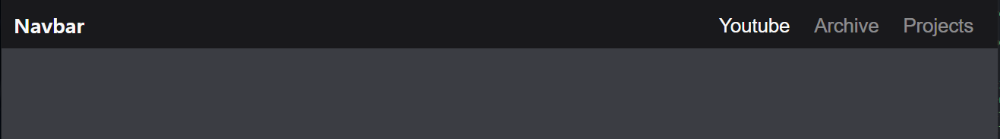
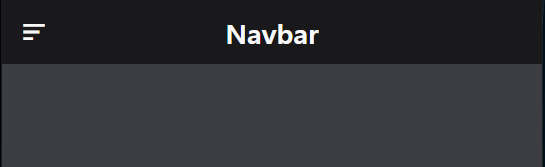
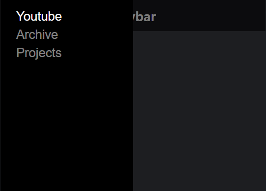

# Day 8 | Responsive Navbar #1

- 큰 화면

 </br></br>

- 작은 화면

 </br></br>

- 메뉴 버튼 클릭 시 사이드 메뉴바

 </br>

---

```html
<!-- index.html -->
    <nav class="navbar">
        <div class="navbar-overlay" onclick="toggleMenuOpen()"></div>
        <button type="button" class="navbar-burger" onclick="toggleMenuOpen()">
            <i class='bx bx-menu-alt-left'></i>
        </button>

        <h1 class="navbar-title">Navbar</h1>
        <nav class="navbar-menu">
            <button type="button" class="active">Youtube</button>
            <button type="button" >Archive</button>
            <button type="button" >Projects</button>
        </nav>
    </nav>
```

```js
// index.js
const toggleMenuOpen = () => {
    document.body.classList.toggle("open");
};
```

```css
/* index.css */
*{
    box-sizing: border-box;
    margin: 0;
    padding: 0;
}

body{
    background-color: #3b3d43;
}

button{
    cursor: pointer;
    border: none;
    background-color: transparent;
    color: inherit;
}

button i {
    font-size: 2rem;
}
.navbar{
    position: fixed;
    z-index: 1;
    top: 0;
    left: 0;
    align-items: center;
    display: flex;
    justify-content: center;
    width: 100%;
    height: 64px;
    background-color: #19191c;
    color: #f9f9f9; 
}

.navbar-overlay{
    position: fixed;
    z-index: 2;
    top: 0;
    left: 0;
    width: 100%;
    height: 100%;
    background-color: rgba(0, 0, 0, 0.5);
    transition: 0.3s;
    visibility: hidden;
    opacity: 0;
    /* visibility와 opacity를 같이 줘야함. */
}

body.open .navbar-overlay{
    visibility: visible;
    opacity: 1;
}

.navbar-burger{
    position: absolute;
    top: 0;
    left: 0;
    display: gird;
    place-items: center;
    height: 100%;
    width: 64px;
}

.navbar-title{
    font-size: 1.7rem;
}

.navbar-menu{
    position: fixed;
    z-index: 3;
    top: 0;
    left: 0;
    translate: -100% 0;
    width: 270px;
    height: 100%;
    padding: 20px;
    display: flex;
    gap: 8px;
    flex-direction: column;
    align-items: flex-start;
    background-color: #000;
    visibility: hidden;
    transition: all 0.3s;
}

body.open .navbar-menu{
    visibility: visible;
    top: 0;
    left: 0;
    translate: 0;
}

.navbar-menu button{
    color: rgba(255, 255, 255, 0.5);
    font-size: 1.6rem;
    padding: 0 12px;
    transition: all 0.3s;
}

.navbar-menu button.active{
    color: inherit;
}

.navbar-menu button:hover{
    color: rgba(255, 255, 255, 0.7);
}

@media only screen and (min-width: 600px){
    .navbar{
        justify-content: space-between;
        padding: 0 0 0 16px;
    }
    .navbar-overlay,
    .navbar-burger{
        display: none;
    }
    .navbar-menu{
        position: static;
        width: auto;
        visibility: visible;
        translate: 0;
        background-color: transparent;
        flex-direction: row;
    }
}
```