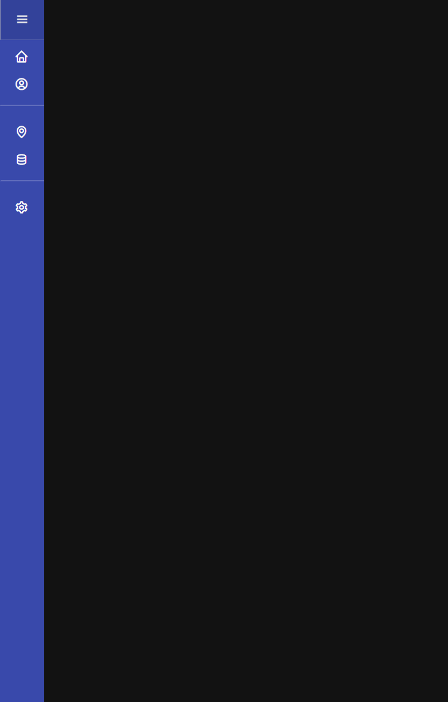
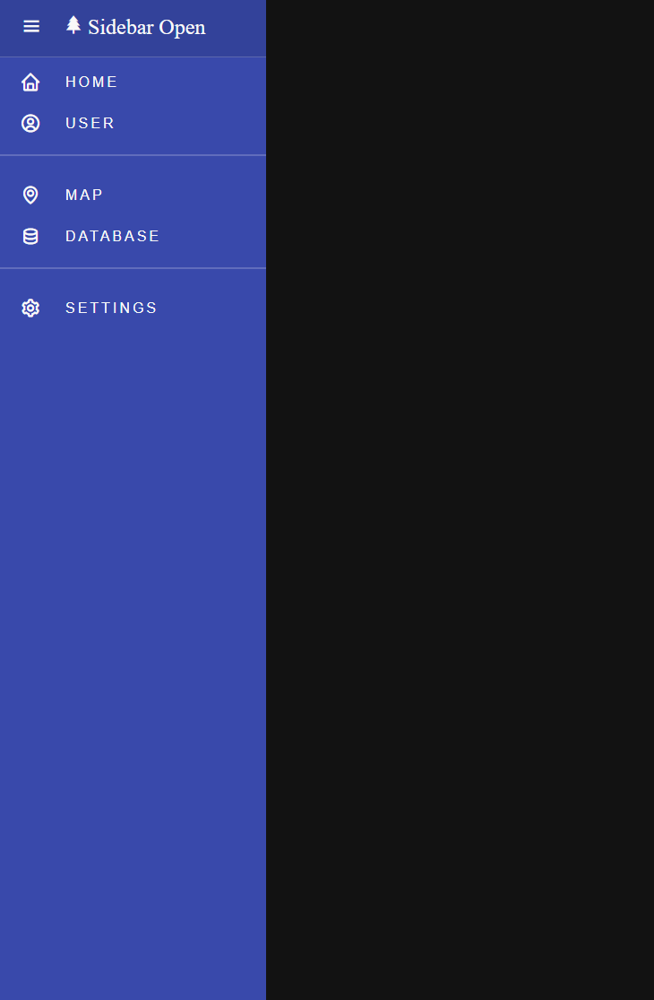

# Day 3 | Responsive Sidebar

- 기본 아이콘으로만 간단하게 표시

<br><br>

- 햄버거 아이콘에 마우스 호버 시 확장

<br>

```html
<!-- index.html -->
<!DOCTYPE html>
<html lang="en">

<head>
    <meta charset="UTF-8">
    <meta http-equiv="X-UA-Compatible" content="IE=edge">
    <meta name="viewport" content="width=device-width, initial-scale=1.0">
    <title>Day 3 | Responsive Sidebar #1</title>
    <link href='https://unpkg.com/boxicons@2.1.4/css/boxicons.min.css' rel='stylesheet'>
    <link rel="stylesheet" href="./index.css">
    <script src="./index.js" defer></script>
</head>
<body>
    <nav class='sidebar'>
        <div class="sidebar-inner">
            <header class="sidebar-header">
                <button type="button" class="sidebar-burger" onclick="toggleSidebar()">
                    <i class='bx bx-menu'></i>
                </button>
                <div class="sidebar-logoWrapper">
                    <i class='bx bxs-tree sidebar-logo'></i>
                    <span class="sidebar-logoName">Sidebar Open</span>
                </div>
            </header>

            <nav class="sidebar-menu">
                <button type="button">
                    <i class='bx bx-home' ></i>
                    <span>Home</span>
                </button>
                <button type="button" class="has-border">
                    <i class='bx bx-user-circle' ></i>
                    <span>User</span>
                </button>
                <button type="button">
                    <i class='bx bx-map' ></i>
                    <span>Map</span>
                </button>
                <button type="button" class="has-border">
                    <i class='bx bx-data' ></i>
                    <span>Database</span>
                </button>
                <button type="button">
                    <i class='bx bx-cog' ></i>
                    <span>Settings</span>
                </button>
            </nav>
        </div>
    </nav>
</body>

</html>
```

```js
// index.js
const toggleSidebar = () => {
    document.querySelector("nav").classList.toggle('open');
};
```

```css
/* index.css */
* {
    box-sizing: border-box;
    padding: 0;
    margin: 0;
}

body {
    background-color: #121212;
}

button {
    background-color: transparent;
    border: 0;
    padding: 0;
    cursor: pointer;
}

.sidebar {
    position: absolute;
    overflow: hidden;
    top: 0;
    left: 0;
    width: 75px;
    height: 100%;
    background-color: #3949ab;
    transition: all 0.3s;
}

.sidebar.open {
    width: 300px;
}

.sidebar-inner {
    position: absolute;
    top: 0;
    left: 0;
    width: 300px;
}

.sidebar-header {
    display: flex;
    align-items: center;
    height: 68px;
    padding: 0 1.25rem 0 0;
    background-color: rgba(0, 0, 0, 0.1);
    border-left: 3px solid transparent;
    transition: all 0.3s;
    border-bottom: 1px solid rgba(255, 255, 255, 0.2);
}

.sidebar-header:hover {
    border-left: 3px solid #bdbdbd;
}

.sidebar-burger {
    width: 70px;
    height: 70px;
}

.sidebar-burger i {
    font-size: 25px;
    transition: all 0.3s;
    color: #f9f9f9;
}

.sidebar-burger:hover i {
    color: #bdbdbd;
}
.sidebar-logoWrapper{
    transition: all 2s;
    opacity: 0;
}

.sidebar-logo,
.sidebar-logoName{
    font-size: 24px;
    color: #f9f9f9;
}

.sidebar.open .sidebar-logoWrapper{
    opacity: 1;
}

.sidebar-menu{
    display: grid;
}

.sidebar-menu button{
    display: flex;
    gap: 12px;
    align-items: center;
    height: 55px;
    font-size: 16px;
    font-weight: 400;
    letter-spacing: 3px;
    line-height: 1;
    padding: 0 22px;
    border-left: 3px solid transparent;
    transition: all 0.3s;
}

.sidebar-menu button.has-border{
    padding-bottom: 1rem;
    border-bottom: 2px solid rgba(255, 255, 255, 0.2);
    margin-bottom: 1rem;
}

.sidebar-menu button i{
    font-size: 24px;
    color: #f9f9f9;
    transition: all 0.3s;
}

.sidebar-menu button:hover span{
    color: #bdbdbd;
    transition: all 0.3s;
}

.sidebar-menu button span{
    opacity: 0;
    transition: all 0.3s;
    color: #f9f9f9;
    text-transform: uppercase;
    padding-left: 12px;
}

.sidebar.open .sidebar-menu button span{
    transition: all 0.3s;
    opacity: 1;
}
```