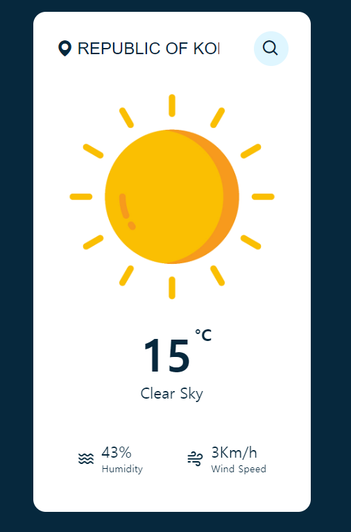
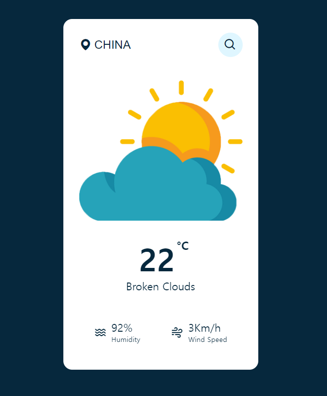
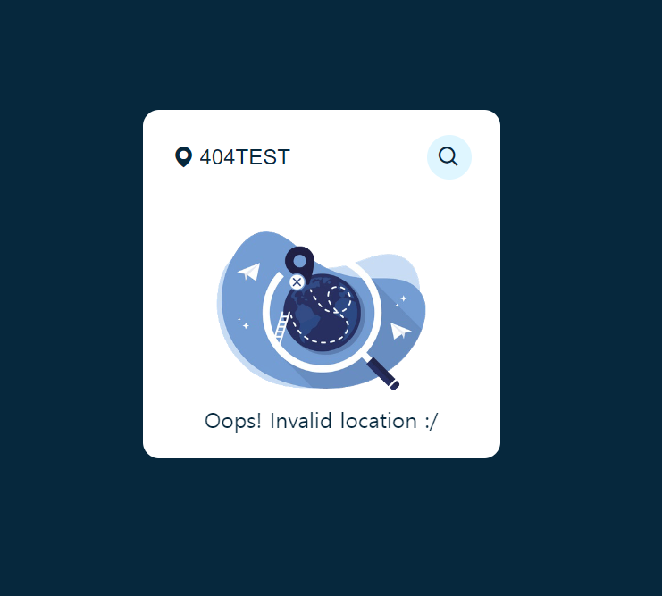

# Weather App

> 날씨 Api 사용 : 'https://openweathermap.org/';
- 첫 화면


- 한국 검색


- 중국 검색


- not found 화면


---

## 코드
- index.html
```html
<!DOCTYPE html>
<html lang="en">
<head>
    <meta charset="UTF-8">
    <meta http-equiv="X-UA-Compatible" content="IE=edge">
    <meta name="viewport" content="width=device-width, initial-scale=1.0">
    <title>Day 2 | Weather App</title>
    <link href='https://unpkg.com/boxicons@2.1.4/css/boxicons.min.css' rel='stylesheet'>
    <link rel="stylesheet" href="./index.css">
    <script src="index.js" defer></script>
</head>
<body>
    <div class="container">
        <div class="search-box">
            <i class='bx bxs-map'></i>
            <input type="text" placeholder="Enter your location">
            <button class="">
                <i class='bx bx-search'></i>
            </button>
        </div>
        <div class="not-found">
            
            <p>Oops! Invalid location :/</p>
        </div>
        <div class="weather-box">
            
            <p class="temperature"></p>
            <p class="description"></p>
        </div>
        <div class="weather-details">
            <div class="humidity">
                <i class='bx bx-water'></i>
                <div class="text">
                    <span></span>
                    <p>Humidity</p>
                </div>
            </div>
            <div class="wind">
                <i class='bx bx-wind'></i>
                <div class="text">
                    <span></span>
                    <p>Wind Speed</p>
                </div>
            </div>
        </div>
    </div>
</body>
</html>
```
<br>

- index.js
```js
const container = document.querySelector(".container");
const search = document.querySelector(".search-box button");
const weatherBox = document.querySelector(".weather-box");
const weatherDetails = document.querySelector(".weather-details");
const error404 = document.querySelector(".not-found");

search.addEventListener("click", () => {
  const API_KEY = "865af352b2c597a2b231b150c1f98abd";
  const city = document.querySelector(".search-box input").value;

  if (city === "") return;

  fetch(
    `https://api.openweathermap.org/data/2.5/weather?q=${city}&units=metric&appid=${API_KEY}`
  )
    .then((res) => res.json())
    .then((data) => {
        console.log('data', data)
      if ((data.cod === "404")) {
        container.style.height = "fit-content";
        weatherBox.style.display = "none";
        weatherDetails.style.display = "none";
        error404.style.display = "block";
        error404.classList.add("fade-in");
        return;
      }

      error404.style.display = "none";
      error404.classList.remove = "fade-in";

      const img = document.querySelector(".weather-box img");
      const temperature = document.querySelector(".weather-box .temperature");
      const description = document.querySelector(".weather-box .description");
      const humidity = document.querySelector(".weather-details .humidity .text span");
      const wind = document.querySelector(".weather-details .wind .text span");

      switch (data.weather[0].main) {
        case "Clear":
          img.src = "./imgs/clear.png";
          break;
        case "Rain":
          img.src = "./imgs/rain.png";
          break;
        case "Snow":
          img.src = "./imgs/snow.png";
          break;
        case "Clouds":
          img.src = "./imgs/cloud.png";
          break;
        case "mist":
          img.src = "./imgs/mist.png";
          break;
        default:
          img.src = "";
      };

      temperature.innerHTML = `${parseInt(data.main.temp)}<span>°C</span>`;
      description.innerHTML = `${data.weather[0].description}`;
      humidity.innerHTML = `${data.main.humidity}%`;
      wind.innerHTML = `${parseInt(data.wind.speed)}Km/h`;

      weatherBox.style.display = '';
      weatherDetails.style.display = '';
      weatherBox.classList.add('fade-in');
      weatherDetails.classList.add('fade-in');
      container.style.height = "fit-content";
    });
});
```
<br>

- index.css
```css
*{
    margin: 0;
    padding: 0;
    box-sizing: border-box;
    outline: none;
    border: 0;
}

body{
    height: 100vh;
    width: 100%;
    /* display: flex;
    align-items: center;
    justify-content: center; */
    display: grid;
    place-items: center;
    background-color: #06283d;
}

.container{
    position: relative;
    width: 400px;
    height: 105px;
    background-color: #fff;
    padding:  28px 32px;
    overflow: hidden;
    border-radius: 18px;
    transition: 0.5s ease-out;
}

.search-box{
    width: 100%;
    height: min-content;
    display: flex;
    align-items: center;
    justify-content: space-between;
}

.search-box input {
    color: #06283d;
    width: 80%;
    font-size: 1.5rem;
    font-weight: 500;
    text-transform: uppercase;
    padding: 0 32px;
}

.search-box input::placeholder{
    font-size: 1.25rem;
    font-weight: 500;
    color: #06283d;
    text-transform: capitalize;
}

.search-box button{
    display: flex;
    justify-content: center;
    align-items: center;
    cursor: pointer;
    width: 50px;
    height: 50px;
    color: #06283d;
    background-color: #dff6ff;
    border-radius: 50%;
    font-size: 1.35rem;
    transition: 0.5s ease;
}

.search-box button:hover{
    color: #fff;
    background-color: #06283d;
}

.search-box i{
    position: absolute;
    color: #06283d;
    font-size: 1.75rem;
}

.weather-box{
    text-align: center;
}

.weather-box img{
    width: 100%;
}

.weather-box .temperature{
    position: relative;
    color: #06283d;
    font-size: 4rem;
    font-weight: 800;
    margin-top: 30px;
    margin-left: -16px;
}

.weather-box .temperature span{
    position: absolute;
    margin-left: 4px;
    font-size: 1.5rem;
}

.weather-box .description{
    color: #06283d;
    font-size: 1.35rem;
    font-weight: 500    ;
    text-transform: capitalize;
}

.weather-details{
    width: 100%;
    display: flex;
    justify-content: space-around;
    margin-top: 30px;
}

.weather-details .wind,
.weather-details .humidity{
    display: flex;
    align-items: center;
    height: 100px;
}

.weather-details i{
    color: #03283d;
    font-size: 1.6rem;
    margin: 6px 10px 0 0;
}

.weather-details span{
    color: #06283d;
    font-size: 1.4rem;
    font-weight: 500;
}

.weather-details p{
    color: #06283d;
    font-size: 0.9rem;
    font-weight: 500;
}

.not-found{
    width: 100%;
    text-align: center;
    margin-top: 58px;
    scale: 0;
    opacity: 0;
    display: none;
}

.not-found img{
    width: 70%;
}

.not-found p{
    color: #06283d;
    font-size: 1.5rem;
    font-weight: 500;
    margin-top: 12px;
}

.weather-box, .weather-details{
    scale: 0;
    opacity: 0;
}

.fade-in{
    animation: 0.5s fadeIn forwards;
    animation-delay: 0.3s;
}

@keyframes fadeIn{
    to{
        scale: 1;
        opacity: 1;
    }
}
```